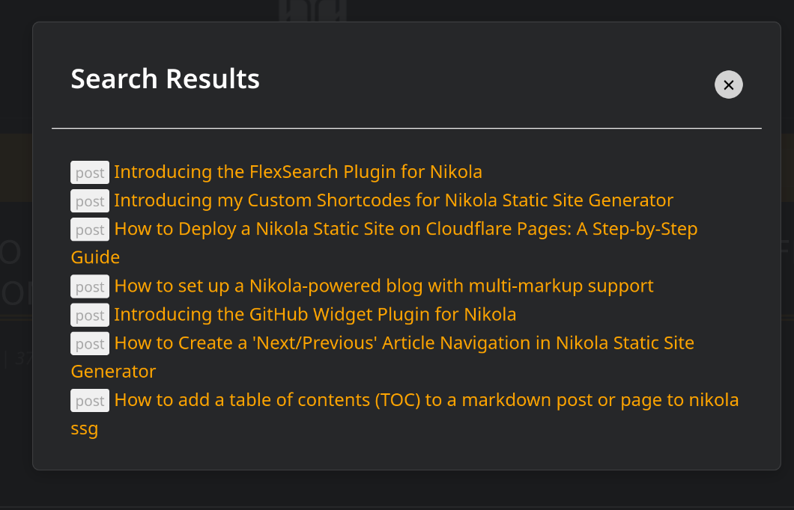

# flexsearch_plugin

This plugin adds search functionality to a Nikola Site.

It generates a json with all the articles, slugs and titles and then uses [flexsearch](https://github.com/nextapps-de/flexsearch) to search.

It supports searching clicking the search button or pressing enter. 

The s`earch_index.json` is (re)generated on `nikola build`

# How to use

There are 2 options:

- Use a normal div and add the search results there.
- Use an overlay with the search results.

Here is an example of the overlay:



For a live example check https://diegocarrasco.com


## Use a normal div and extend and populate it withthe results

Append this to your `BODY_END` in `conf.py`

```html
<script src="https://rawcdn.githack.com/nextapps-de/flexsearch/0.7.31/dist/flexsearch.bundle.js"></script>
<script>
document.addEventListener('DOMContentLoaded', function() {
    var searchIndex = new FlexSearch.Index();  // Initialize FlexSearch
    var index = {};  // This will store the index data globally within this script block

    // Fetch the generated JSON file
    fetch('search_index.json')
    .then(response => response.json())
    .then(data => {
        index = data;  // Store the fetched data in the 'index' variable
        // Load the index with data
        for (var key in index) {
            if (index.hasOwnProperty(key)) {
                searchIndex.add(key, index[key].content);
            }
        }
    });

    // Function to perform search
    function performSearch() {
        var query = document.getElementById('search_input').value;
        var results = searchIndex.search(query);
        var resultsContainer = document.getElementById('search_results');
        resultsContainer.innerHTML = ''; // Clear previous results

        // Display results
        results.forEach(function(result) {
            var div = document.createElement('div');
            var link = document.createElement('a');
            link.href = index[result].url;
            link.textContent = index[result].title;
            div.appendChild(link);
            resultsContainer.appendChild(div);
        });
    }

    // Event listener for search button click
    document.getElementById('search_button').addEventListener('click', performSearch);

    // Event listener for pressing enter key in the search input
    document.getElementById('search_input').addEventListener('keypress', function(event) {
        if (event.key === "Enter") {
            event.preventDefault();  // Prevent the form from being submitted
            performSearch();
        }
    });
});
</script>
```

then add this where you want the search to appear

```html
<input type="text" id="search_input">
<button id="search_button">Search</button>
<div id="search_results"></div>
```


## Use an overlay for the results

This js allows to click the button or press enter to search

```html
<script src="https://rawcdn.githack.com/nextapps-de/flexsearch/0.7.31/dist/flexsearch.bundle.js"></script>

<script>
document.addEventListener('DOMContentLoaded', function() {
    var searchIndex = new FlexSearch.Index();  // Initialize FlexSearch
    var index = {};  // This will store the index data globally within this script block

    // Fetch the generated JSON file
    fetch('search_index.json')
    .then(response => response.json())
    .then(data => {
        index = data;
        for (var key in index) {
            if (index.hasOwnProperty(key)) {
                searchIndex.add(key, index[key].content);
            }
        }
    });

    var input = document.getElementById('search_input');
    var button = document.getElementById('search_button');

    // Function to perform search
    function performSearch() {
        var query = input.value;
        var results = searchIndex.search(query);
        var resultsContainer = document.getElementById('search_results');
        resultsContainer.innerHTML = ''; // Clear previous results
        results.forEach(function(result) {
            var div = document.createElement('div');
            var link = document.createElement('a');
            link.href = index[result].url;
            link.textContent = index[result].title;
            div.appendChild(link);
            resultsContainer.appendChild(div);
        });
        document.getElementById('search_overlay').style.display = 'flex'; // Show the overlay
    }

    // Event listener for search button click
    button.addEventListener('click', performSearch);

    // Event listener for pressing enter key in the search input
    input.addEventListener('keypress', function(event) {
        if (event.key === "Enter" || event.keyCode === 13) {
            event.preventDefault();  // Prevent the form from being submitted
            performSearch();
        }
    });
});

// Function to close the search overlay
function closeSearch() {
    document.getElementById('search_overlay').style.display = 'none';
}
</script>
```

add this to your template where you want the search to appear

```html
<div id="search_overlay" style="display:none;">
    <div id="search_content">
        <button onclick="closeSearch()">Close</button>
        <div id="search_results"></div>
    </div>
</div>
<input type="text" id="search_input">
<button id="search_button">Search</button>
```

add css for the overlay

```html
/* flexsearch_plugin*/

#search_overlay {
    position: fixed; /* Fixed position to cover the whole screen */
    width: 100%;
    height: 100%;
    top: 0;
    left: 0;
    background: rgba(0, 0, 0, 0.8); /* Semi-transparent background */
    z-index: 1000; /* Make sure it's on top of other content */
    display: flex;
    justify-content: center;
    align-items: center;
}

#search_content {
    background: white;
    padding: 20px;
    width: 90%;
    max-width: 600px; /* Limit the width on larger screens */
    border-radius: 5px;
    box-shadow: 0 4px 6px rgba(0,0,0,0.1);
}

#search_results {
    margin-top: 20px;
}

button {
    cursor: pointer;
}
```

## License

this plugin is under the MIT License

MIT License

Copyright (c) [2024] [Diego Carrasco G.]

Permission is hereby granted, free of charge, to any person obtaining a copy
of this software and associated documentation files (the "Software"), to deal
in the Software without restriction, including without limitation the rights
to use, copy, modify, merge, publish, distribute, sublicense, and/or sell
copies of the Software, and to permit persons to whom the Software is
furnished to do so, subject to the following conditions:

The above copyright notice and this permission notice shall be included in all
copies or substantial portions of the Software.

THE SOFTWARE IS PROVIDED "AS IS", WITHOUT WARRANTY OF ANY KIND, EXPRESS OR
IMPLIED, INCLUDING BUT NOT LIMITED TO THE WARRANTIES OF MERCHANTABILITY,
FITNESS FOR A PARTICULAR PURPOSE AND NONINFRINGEMENT. IN NO EVENT SHALL THE
AUTHORS OR COPYRIGHT HOLDERS BE LIABLE FOR ANY CLAIM, DAMAGES OR OTHER
LIABILITY, WHETHER IN AN ACTION OF CONTRACT, TORT OR OTHERWISE, ARISING FROM,
OUT OF OR IN CONNECTION WITH THE SOFTWARE OR THE USE OR OTHER DEALINGS IN THE
SOFTWARE.
